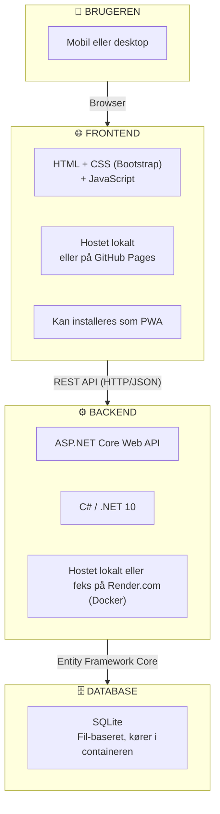
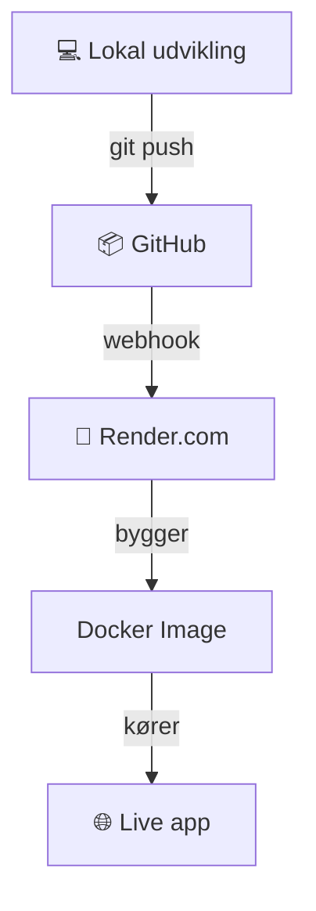
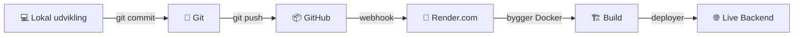

# Overblik

I dette kursus bygger vi en moderne webapplikation fra bunden. Her får du et overblik over de teknologier, vi bruger – og hvorfor.

## Hvad bygger vi?

Vi udvikler en webapplikation, der simulerer et **ERP-system** (Enterprise Resource Planning) baseret på den klassiske **Northwind-database**.

Her er links til eksempelkoden:

- Kode: https://github.com/devcronberg/Northwind.App.Backend
    - Deployment: https://northwind-backend-b088.onrender.com
- Kode: https://github.com/devcronberg/Northwind.App.Frontend
    - Deployment: https://devcronberg.github.io/Northwind.App.Frontend/

### Om Northwind-databasen

**Northwind-databasen** er en kendt eksempeldatabase fra Microsoft, som oprindeligt fulgte med Microsoft Access som en del af Microsoft Office 2000. Den repræsenterer data for en fiktiv virksomhed ved navn **"Northwind Traders"**, der handler med specialfødevarer.

**Historien:**

Northwind blev introduceret for at hjælpe udviklere og studerende med at lære at arbejde med databaser ved hjælp af realistiske data. Selvom den ikke længere er inkluderet i de nyeste versioner af Microsoft Access, forbliver Northwind en populær ressource til læring af SQL og databasekoncepter.

**Hvad indeholder databasen?**

Databasen indeholder tabeller for:

- **Products** – Produkter Northwind Traders sælger
- **Customers** – Kunder der handler med virksomheden
- **Orders** – Kundeordrer
- **Employees** – Medarbejdere
- **Suppliers** – Leverandører
- **Categories** – Produktkategorier
- **Shippers** – Fragtfirmaer

Disse tabeller demonstrerer mange almindelige relationelle databasemønstre, herunder et-til-mange og mange-til-mange relationer. For eksempel kan en forespørgsel hente alle produkter i en bestemt kategori, eller finde alle ordrer placeret af en specifik kunde.

### Vores applikation

Applikationen giver brugerne mulighed for at:

- **Se og søge** i kunder, produkter, ordrer og kategorier
- **Oprette, redigere og slette** data (CRUD operationer)
- **Logge ind** med bruger-authentication
- **Få overblik** over statistik og nøgletal
- **Bruge appen** på både mobil og desktop
- **Installere** applikationen som en PWA (Progressive Web App)

## Arkitekturoverblik

Vores applikation består af to hoveddele, der kommunikerer med hinanden:



---

## Backend

### .NET 10 og C\#

**.NET** er Microsofts platform til at bygge applikationer. **C#** er programmeringssproget, vi skriver koden i.

**Hvorfor .NET?**

- Modent og velafprøvet framework
- Høj ydeevne
- Stort community og god dokumentation
- Gratis og open source

### ASP.NET Core Web API

**ASP.NET Core** er et framework til at bygge webapplikationer. Vi bruger det til at lave en **Web API** – en server, der modtager forespørgsler og sender data tilbage.

!!! info "Andre Backend Teknologier"
    Der findes mange alternative teknologier til at bygge backend-applikationer – nogle kan endda være bedre egnede til dit specifikke projekt! Her er nogle populære alternativer:
    
    **Node.js** med Express eller NestJS – særligt populært i JavaScript/TypeScript miljøer  
    **Python** med Django eller FastAPI – fremragende til data science integration  
    **Java** med Spring Boot – industristandard i mange enterprise virksomheder  
    **Go** – ekstremt performant til microservices og cloud-native apps  
    **Ruby** med Rails – kendt for hurtig udvikling og "convention over configuration"  
    **PHP** med Laravel eller Symfony – stadig meget udbredt til webudvikling  
    **Rust** med Actix eller Rocket – når performance og sikkerhed er kritisk
    
    Valget af teknologi afhænger af faktorer som team-kompetencer, projektets krav, eksisterende infrastruktur og økosystem. .NET er et solidt valg med bred anvendelse, men det er altid værd at evaluere alternativer baseret på dit konkrete behov.

### Hvad er en REST API?

REST (Representational State Transfer) er en arkitekturstil til at bygge web-tjenester. I praksis betyder det:

- Klienten (frontend) sender HTTP-forespørgsler (GET, POST, PUT, DELETE)
- Serveren (backend) svarer med data i JSON-format

### Hvad er JSON?

JSON (JavaScript Object Notation) er et tekstformat til at strukturere data. Det er let at læse for både mennesker og computere, og det er standarden for dataudveksling på nettet.

```json
{
  "id": 1,
  "name": "Laptop",
  "price": 7999.00,
  "inStock": true
}
```

JSON bruger:

- `{ }` til objekter (samling af nøgle-værdi par)
- `[ ]` til lister/arrays
- Nøgler i anførselstegn (`"name"`)
- Værdier som tekst, tal, true/false eller null

Eksempel på REST-kald:
```
GET /api/products        → Hent alle produkter
GET /api/products/1      → Hent produkt med id 1
POST /api/products       → Opret nyt produkt
PUT /api/products/1      → Opdater produkt med id 1
DELETE /api/products/1   → Slet produkt med id 1
```

### Entity Framework Core

**Entity Framework Core (EF Core)** er en ORM (Object-Relational Mapper) til .NET. Den fungerer som et lag mellem din C#-kode og databasen.

**Hvad betyder det i praksis?**

I stedet for at skrive SQL-forespørgsler direkte, arbejder du med C#-objekter:

```csharp
// Uden EF Core (rå SQL)
"SELECT * FROM Products WHERE Id = 1"

// Med EF Core (C#)
var product = context.Products.Find(1);
```

**Fordele ved EF Core:**

- Skriver SQL for dig automatisk
- Understøtter mange databaser (SQLite, SQL Server, PostgreSQL, MySQL)
- Migrations – hold styr på ændringer i databasestrukturen
- Stærk typning – færre fejl

**Hvordan virker det?**

1. Du definerer en **model** (en C#-klasse)
2. EF Core opretter den tilsvarende tabel i databasen
3. Du bruger **LINQ** til at forespørge data

```csharp
// Model
public class Product
{
    public int Id { get; set; }
    public string Name { get; set; }
    public decimal Price { get; set; }
}

// Forespørgsel
var billigeProdukter = context.Products
    .Where(p => p.Price < 100)
    .ToList();
```

### SQLite

**SQLite** er en letvægts database, der gemmer alt i én fil. Den kræver ingen separat server-installation.

**Hvorfor SQLite?**

- Ingen opsætning nødvendig
- Perfekt til udvikling og mindre applikationer
- Nemt at distribuere (det er bare en fil)
- Understøttet af Entity Framework Core

!!! note "I produktion"
    Til større applikationer ville man typisk bruge PostgreSQL, SQL Server eller MySQL. Men til vores MVP er SQLite perfekt.

### Docker – Containerisering forklaret

**Docker** kan virke kompliceret i starten, men konceptet er faktisk ret simpelt. 

#### Hvad er problemet Docker løser?

Før Docker stødte man ofte på problemet: **"Det virker på min computer!"**

**Scenariet:**

- Du udvikler en applikation på din Windows-maskine
- Du sender koden til en kollega med Mac
- Applikationen virker ikke – forskellige versioner af .NET, manglende biblioteker, forskellige miljøvariabler
- I produktion kører serveren Linux – endnu flere forskelle!

#### Hvad er en container?

En **container** er som en komplet pakke, der indeholder:

- Din applikation (kode)
- Runtime (.NET 10)
- Alle nødvendige biblioteker og afhængigheder
- Konfigurationsfiler
- Databasen (i vores tilfælde SQLite-filen)

**Analogi:** Tænk på en container som en flyttekasse:

- Du pakker alt du skal bruge (din app + dependencies) i kassen
- Du kan flytte kassen overalt (Windows, Mac, Linux, cloud)
- Når du åbner kassen, er alt der – præcis som du pakkede det

#### Docker vs. Virtual Machines

| Docker Container          | Virtual Machine            |
| ------------------------- | -------------------------- |
| ✅ Lav (deler host OS)     | ❌ Høj (helt separat OS)    |
| ⚡ Hurtig start (sekunder) | 🐌 Langsom start (minutter) |
| 📦 Lille størrelse (MB)    | 💾 Stor størrelse (GB)      |
| 🚀 Moderne standardmetode  | 🏛️ Ældre teknologi          |

#### Docker Image vs. Docker Container

- **Image** = Opskriften (template/blueprint)
- **Container** = Den kørende applikation (baseret på opskriften)

**Analogi:**

- Image = En kageform
- Container = En færdigbagt kage

Du kan lave mange kager (containere) fra samme form (image).

#### Hvorfor Docker i vores projekt?

1. **Konsistens** – Virker ens lokalt og i produktion
2. **Nem deployment** – Render.com forstår Docker
3. **Isolation** – Applikationen har sit eget miljø
4. **Skalerbarhed** – Nemt at køre flere instances
5. **Standard** – Docker er industri-standard for moderne webudvikling

### Render.com – Cloud hosting

**Render.com** er en moderne cloud-platform, der gør det nemt at deploye applikationer.

**Hvorfor Render.com?**

| Fordel                   | Beskrivelse                                   |
| ------------------------ | --------------------------------------------- |
| 🆓 **Gratis tier**        | Perfekt til læring og små projekter           |
| 🐳 **Docker support**     | Bygger automatisk fra din Dockerfile          |
| 🔄 **Auto-deploy**        | Opdaterer automatisk når du pusher til GitHub |
| 🌍 **Global hosting**     | Hurtige servere verden over                   |
| 📊 **Logs og monitoring** | Se hvad der sker i din applikation            |
| 🔒 **HTTPS automatisk**   | Gratis SSL-certifikater                       |

**Deployment-flowet:**



**Trin for trin:**

1. **Du koder lokalt** – Tester applikationen på din computer
2. **Commit til Git** – `git commit -m "Ny feature"`
3. **Push til GitHub** – `git push origin main`
4. **Render.com notificeres** – Via webhook fra GitHub
5. **Bygger Docker image** – Render læser din Dockerfile
6. **Starter container** – Din app er nu live!
7. **Får en URL** – F.eks. `https://min-app.onrender.com`

!!! warning "Gratis tier begrænsning"
    Render.com's gratis tier har nogle begrænsninger:
    
    - Containeren "sover" efter 15 minutter uden aktivitet
    - Første request efter søvn tager 30-60 sekunder (cold start)
    - 750 timer/måned gratis (nok til vores projekt)
    
    Dette er fint til udvikling og læring, men produktionsapps bør bruge en betalt plan.

#### Alternativer til Render.com

Der findes mange andre hosting-platforme:

- **Heroku** – Klassisk PaaS, tidligere gratis tier (nu kun betalt)
- **Railway** – Moderne, simpel, gratis tier
- **Fly.io** – God til Docker, gratis tier
- **Azure App Service** – Microsoft's cloud (ikke gratis, men $200 credit til start)
- **AWS ECS/Fargate** – Amazon's container hosting (kompleks, men kraftfuld)
- **Google Cloud Run** – Betaler kun for det du bruger

---

## Frontend

### HTML, CSS og JavaScript

Frontenden er det, brugeren ser og interagerer med. Vi holder det så simpelt som muligt:

| Teknologi      | Formål                                                  |
| -------------- | ------------------------------------------------------- |
| **HTML**       | Strukturen på siden (overskrifter, knapper, formularer) |
| **CSS**        | Udseendet (farver, layout, typografi)                   |
| **JavaScript** | Interaktivitet og kommunikation med backend             |

### CSS Frameworks

At skrive al CSS fra bunden er tidskrævende og kræver erfaring med responsive design. Et **CSS framework** giver dig:

- **Færdige komponenter** – knapper, formularer, navigation, modals
- **Responsivt grid-system** – automatisk tilpasning til mobil/tablet/desktop
- **Konsistent design** – professionelt udseende uden at være designer
- **Cross-browser kompatibilitet** – virker i alle moderne browsere

**Populære CSS frameworks:**

| Framework        | Beskrivelse                                                                         | Link                                          |
| ---------------- | ----------------------------------------------------------------------------------- | --------------------------------------------- |
| **Bootstrap**    | Det mest udbredte framework. Stort community, masser af dokumentation og eksempler. | [getbootstrap.com](https://getbootstrap.com/) |
| **Tailwind CSS** | Utility-first framework. Giver fuld kontrol, men kræver mere læring.                | [tailwindcss.com](https://tailwindcss.com/)   |
| **Bulma**        | Rent CSS (ingen JavaScript). Simpelt og moderne.                                    | [bulma.io](https://bulma.io/)                 |
| **UIkit**        | Modulært framework med pæne komponenter og god dokumentation.                       | [getuikit.com](https://getuikit.com/)         |
| **Foundation**   | Professionelt framework med fokus på fleksibilitet.                                 | [get.foundation](https://get.foundation/)     |
| **Fomantic UI**  | Fork af Semantic UI. Intuitive klassenavne.                                         | [fomantic-ui.com](https://fomantic-ui.com/)   |


### GitHub Pages

**GitHub Pages** er en gratis hosting-tjeneste fra GitHub. Den er perfekt til statiske websites (HTML, CSS, JavaScript).

**Sådan virker det:**

1. Du pusher din frontend-kode til et GitHub-repository
2. GitHub Pages serverer automatisk filerne som en hjemmeside
3. Du får en gratis URL: `https://dit-brugernavn.github.io/dit-repo`

---

## Progressive Web App (PWA)

En **PWA** er en webapp, der kan installeres som en "rigtig" app på telefon eller computer.

**Fordele:**

- Kan tilføjes til hjemmeskærmen
- Kører i eget vindue (uden browser-UI)
- Kan virke offline (med service workers)
- Ingen app store nødvendig

**Hvad kræver det?**

- En `manifest.json`-fil med app-metadata
- HTTPS (GitHub Pages giver det automatisk)
- Valgfrit: En service worker til offline-funktionalitet

!!! info
    PWA'er er et stort emne i sig selv. For mere information, se [Google Developers PWA Guide](https://developers.google.com/web/progressive-web-apps).
    Her er et eksempel på en PWA : https://mcronberg.github.io/serialdate/

## Versionsstyring

### Git

**Git** er et versionskontrolsystem. Det holder styr på alle ændringer i din kode, så du kan:

- Se hvad der er ændret og hvornår
- Gå tilbage til tidligere versioner
- Samarbejde med andre uden at overskrive hinandens arbejde

### GitHub

**GitHub** er en platform, der hoster Git-repositories online. Vi bruger GitHub til:

| Funktion           | Beskrivelse                        |
| ------------------ | ---------------------------------- |
| **Kode-hosting**   | Opbevar og del kode                |
| **GitHub Pages**   | Host frontend gratis               |
| **GitHub Actions** | Automatisk build og deploy (CI/CD) |
| **GitHub Copilot** | AI-assisteret kodning              |

---

## Deployment og Automation

### Pipelines – Automatisk deployment

En **pipeline** (også kaldet CI/CD pipeline) er en automatiseret proces, der bygger, tester og deployer din kode uden manuel indgriben.

**Hvad betyder CI/CD?**

- **CI (Continuous Integration)** – Automatisk integration af kodeændringer
- **CD (Continuous Deployment/Delivery)** – Automatisk deployment til produktion

**Navne i forskellige systemer:**

| Platform         | Navn på pipeline/workflow  |
| ---------------- | -------------------------- |
| **GitHub**       | GitHub Actions (workflows) |
| **GitLab**       | GitLab CI/CD (pipelines)   |
| **Azure DevOps** | Azure Pipelines            |
| **Jenkins**      | Jenkins Pipelines          |
| **CircleCI**     | CircleCI Workflows         |
| **Travis CI**    | Travis CI Builds           |
| **Bitbucket**    | Bitbucket Pipelines        |
| **AWS**          | AWS CodePipeline           |

Uanset navnet er konceptet det samme: **Automatiser gentagne opgaver i udviklingsprocessen**.

### GitHub Actions

**GitHub Actions** er GitHubs indbyggede system til at automatisere workflows direkte i dit repository.

**Hvad kan GitHub Actions?**

- **Automatisk bygge** kode når du pusher til GitHub
- **Køre tests** og sikre kvaliteten af koden
- **Deploye** til hosting-platforme (GitHub Pages, Render, Azure, osv.)
- **Automatiske checks** før pull requests merges

**Hvordan virker det?**

1. Du opretter en **workflow-fil** i `.github/workflows/` mappen
2. Workflow-filen definerer **hvornår** og **hvad** der skal ske
3. GitHub Actions kører automatisk når betingelserne er opfyldt

**Workflow-eksempel (konceptuelt):**

```yaml
# Trigger: Kør når der pushes til main branch
on:
  push:
    branches: [main]

# Jobs: Hvad skal der ske?
jobs:
  build-and-deploy:
    steps:
      - Hent koden
      - Installér afhængigheder
      - Byg projektet
      - Kør tests
      - Deploy til hosting
```

**Fordele:**

- ✅ **Gratis for offentlige repos** – Perfekt til open source projekter
- ✅ **Indbygget i GitHub** – Ingen ekstra værktøjer nødvendig
- ✅ **Store marketplace** – Tusindvis af færdige actions
- ✅ **Pålidelig** – Kører automatisk hver gang

### Render.com Auto-Deploy

**Render.com** integrerer direkte med GitHub og kan automatisk deploye din backend når koden ændres.

**Deployment flow:**



**Hvad sker der automatisk?**

1. **Du pusher til GitHub** – Din kode er nu på GitHub
2. **Render.com får besked** – Via en webhook fra GitHub
3. **Bygger Docker image** – Render læser `Dockerfile` og bygger
4. **Starter ny container** – Den gamle container stoppes, den nye startes
5. **Health check** – Render verificerer at appen kører
6. **Traffic omdirigeres** – Brugere får den nye version

**Dette sker alt sammen automatisk** uden at du skal gøre noget!

### Frontend deployment med GitHub Actions

For vores frontend bruger vi GitHub Actions til at deploye til GitHub Pages.

**Processen:**

1. **Push til GitHub** – Du pusher dine ændringer
2. **GitHub Actions workflow kører** – Bygger frontend-filerne
3. **Deployer til GitHub Pages** – Publicerer på `username.github.io/repo`

**Hvad gør workflow'en?**

- Installerer afhængigheder
- Bygger/minifier JavaScript og CSS
- Kopierer filer til `gh-pages` branch
- GitHub Pages serverer automatisk filerne

**Fordele:**

- Ingen manuel FTP-upload
- Ingen manuel build-proces
- Altid den nyeste version online
- Historie over alle deployments

### Hvorfor automatisere?

**Før automation:**

1. Byg projektet manuelt
2. Kør tests manuelt
3. Upload filer til server manuelt
4. Tjek at alt virker manuelt
5. Gentag ved hver ændring... 😫

**Efter automation:**

1. `git push`
2. ✅ Færdig! Alt andet sker automatisk 🎉

**Resultatet:**

- 🚀 **Hurtigere deployment** – Fra minutter til sekunder
- 🐛 **Færre fejl** – Ingen glemte filer eller trin
- 🔄 **Hyppigere opdateringer** – Nemt at deploye små ændringer
- ✅ **Bedre kvalitet** – Tests køres altid før deployment
- 🕒 **Mere tid til kodning** – Mindre tid på deployment


