# Teknologioverblik

I dette kursus bygger vi en moderne webapplikation fra bunden. Her får du et overblik over de teknologier, vi bruger – og hvorfor.

!!! info "For begyndere"
    Hvis du er ny til webudvikling, kan det virke som mange teknologier. Bare rolig – vi tager dem én ad gangen, og du vil hurtigt se, hvordan de spiller sammen.

## Arkitekturoverblik

Vores applikation består af to hoveddele, der kommunikerer med hinanden:

```mermaid
flowchart TB
    subgraph USER["👤 BRUGEREN"]
        direction LR
        U1["Mobil eller desktop"]
    end
    
    subgraph FRONTEND["🌐 FRONTEND"]
        direction LR
        F1["HTML + CSS (Bootstrap) + JavaScript"]
        F2["Hostet på GitHub Pages"]
        F3["Kan installeres som PWA"]
    end
    
    subgraph BACKEND["⚙️ BACKEND"]
        direction LR
        B1["ASP.NET Core Web API"]
        B2["C# / .NET 10"]
        B3["Hostet på Render.com (Docker)"]
    end
    
    subgraph DATABASE["🗄️ DATABASE"]
        direction LR
        D1["SQLite"]
        D2["Fil-baseret, kører i containeren"]
    end
    
    USER -->|"Browser"| FRONTEND
    FRONTEND -->|"REST API (HTTP/JSON)"| BACKEND
    BACKEND -->|"Entity Framework Core"| DATABASE
```



---

## Backend

### .NET 10 og C#

**.NET** er Microsofts platform til at bygge applikationer. **C#** er programmeringssproget, vi skriver koden i.

**Hvorfor .NET?**

- Modent og velafprøvet framework
- Høj ydeevne
- Stort community og god dokumentation
- Gratis og open source

### ASP.NET Core Web API

**ASP.NET Core** er et framework til at bygge webapplikationer. Vi bruger det til at lave en **Web API** – en server, der modtager forespørgsler og sender data tilbage.

**Hvad er en REST API?**

REST (Representational State Transfer) er en arkitekturstil til at bygge web-tjenester. I praksis betyder det:

- Klienten (frontend) sender HTTP-forespørgsler (GET, POST, PUT, DELETE)
- Serveren (backend) svarer med data i JSON-format

Eksempel:
```
GET /api/products        → Hent alle produkter
GET /api/products/1      → Hent produkt med id 1
POST /api/products       → Opret nyt produkt
PUT /api/products/1      → Opdater produkt med id 1
DELETE /api/products/1   → Slet produkt med id 1
```

### Entity Framework Core

**Entity Framework Core (EF Core)** er en ORM (Object-Relational Mapper) til .NET. Den fungerer som et lag mellem din C#-kode og databasen.

**Hvad betyder det i praksis?**

I stedet for at skrive SQL-forespørgsler direkte, arbejder du med C#-objekter:

```csharp
// Uden EF Core (rå SQL)
"SELECT * FROM Products WHERE Id = 1"

// Med EF Core (C#)
var product = context.Products.Find(1);
```

**Fordele ved EF Core:**

- Skriver SQL for dig automatisk
- Understøtter mange databaser (SQLite, SQL Server, PostgreSQL, MySQL)
- Migrations – hold styr på ændringer i databasestrukturen
- Stærk typning – færre fejl

**Hvordan virker det?**

1. Du definerer en **model** (en C#-klasse)
2. EF Core opretter den tilsvarende tabel i databasen
3. Du bruger **LINQ** til at forespørge data

```csharp
// Model
public class Product
{
    public int Id { get; set; }
    public string Name { get; set; }
    public decimal Price { get; set; }
}

// Forespørgsel
var billigeProdukter = context.Products
    .Where(p => p.Price < 100)
    .ToList();
```

### SQLite

**SQLite** er en letvægts database, der gemmer alt i én fil. Den kræver ingen separat server-installation.

**Hvorfor SQLite?**

- Ingen opsætning nødvendig
- Perfekt til udvikling og mindre applikationer
- Nemt at distribuere (det er bare en fil)
- Understøttet af Entity Framework Core

!!! note "I produktion"
    Til større applikationer ville man typisk bruge PostgreSQL, SQL Server eller MySQL. Men til vores MVP er SQLite perfekt.

### Docker og Render.com

**Docker** er en teknologi, der pakker din applikation sammen med alt, den har brug for (runtime, biblioteker osv.) i en **container**. Det sikrer, at applikationen kører ens overalt.

**Render.com** er en cloud-platform, der kan hoste vores Docker-container. De har et gratis tier, der er perfekt til læring og små projekter.

**Flowet:**

1. Vi skriver kode lokalt
2. Vi pusher til GitHub
3. Render.com bygger automatisk en Docker-container
4. Containeren kører på Render's servere

---

## Frontend

### HTML, CSS og JavaScript

Frontenden er det, brugeren ser og interagerer med. Vi holder det så simpelt som muligt:

| Teknologi      | Formål                                                  |
| -------------- | ------------------------------------------------------- |
| **HTML**       | Strukturen på siden (overskrifter, knapper, formularer) |
| **CSS**        | Udseendet (farver, layout, typografi)                   |
| **JavaScript** | Interaktivitet og kommunikation med backend             |

### Bootstrap

**Bootstrap** er et populært CSS-framework, der giver os:

- Færdige komponenter (knapper, formularer, navigation)
- Responsivt grid-system (virker på mobil og desktop)
- Konsistent design uden at skrive meget CSS

**Hvorfor Bootstrap?**

- Hurtigt at komme i gang
- God dokumentation
- Bredt udbredt (let at finde hjælp)

[Bootstrap dokumentation →](https://getbootstrap.com/)

### GitHub Pages

**GitHub Pages** er en gratis hosting-tjeneste fra GitHub. Den er perfekt til statiske websites (HTML, CSS, JavaScript).

**Sådan virker det:**

1. Du pusher din frontend-kode til et GitHub-repository
2. GitHub Pages serverer automatisk filerne som en hjemmeside
3. Du får en gratis URL: `https://dit-brugernavn.github.io/dit-repo`

---

## Progressive Web App (PWA)

En **PWA** er en webapp, der kan installeres som en "rigtig" app på telefon eller computer.

**Fordele:**

- Kan tilføjes til hjemmeskærmen
- Kører i eget vindue (uden browser-UI)
- Kan virke offline (med service workers)
- Ingen app store nødvendig

**Hvad kræver det?**

- En `manifest.json`-fil med app-metadata
- HTTPS (GitHub Pages giver det automatisk)
- Valgfrit: En service worker til offline-funktionalitet

---

## Versionsstyring

### Git

**Git** er et versionskontrolsystem. Det holder styr på alle ændringer i din kode, så du kan:

- Se hvad der er ændret og hvornår
- Gå tilbage til tidligere versioner
- Samarbejde med andre uden at overskrive hinandens arbejde

### GitHub

**GitHub** er en platform, der hoster Git-repositories online. Vi bruger GitHub til:

| Funktion           | Beskrivelse                        |
| ------------------ | ---------------------------------- |
| **Kode-hosting**   | Opbevar og del kode                |
| **GitHub Pages**   | Host frontend gratis               |
| **GitHub Actions** | Automatisk build og deploy (CI/CD) |
| **GitHub Copilot** | AI-assisteret kodning              |

---

## Opsummering

| Lag                 | Teknologi                         | Hosting              |
| ------------------- | --------------------------------- | -------------------- |
| **Frontend**        | HTML, CSS (Bootstrap), JavaScript | GitHub Pages         |
| **Backend**         | .NET 10, C#, ASP.NET Core Web API | Render.com (Docker)  |
| **Database**        | SQLite                            | I Docker-containeren |
| **Versionsstyring** | Git + GitHub                      | -                    |

```mermaid
flowchart LR
    A["🌐 Frontend<br/>GitHub Pages"] -->|"REST API"| B["⚙️ Backend<br/>Render.com"]
    B -->|"SQL"| C["🗄️ Database<br/>SQLite"]
```



!!! success "Simpelt men kraftfuldt"
    Denne stack er enkel at forstå og gratis at hoste – men den lærer dig de samme koncepter, som bruges i store produktionsapplikationer.
